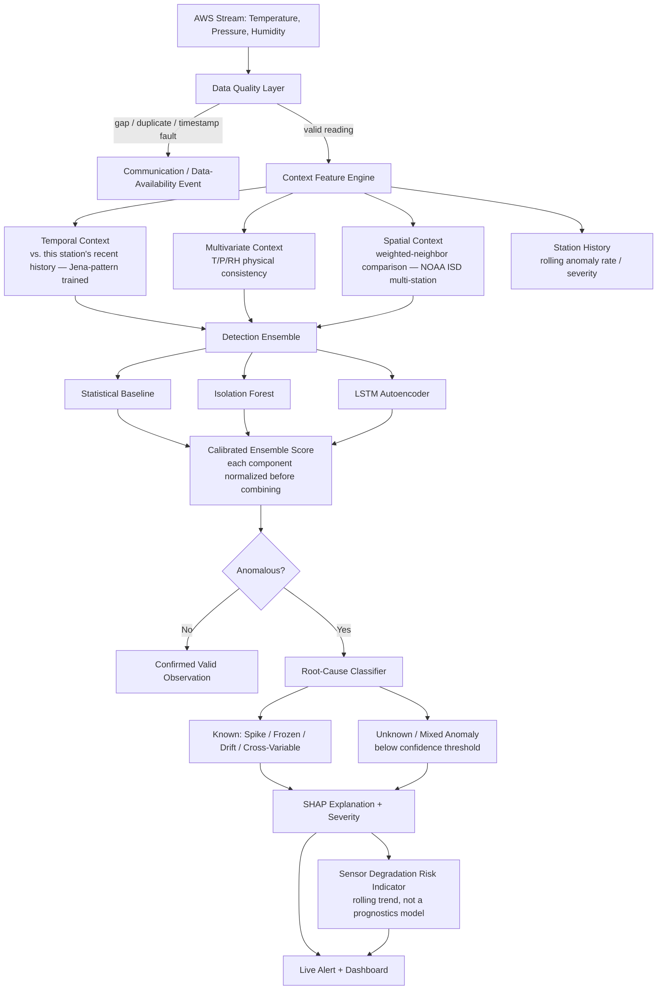

# SkyGuard AI — Selection-Ready Blueprint V2
### SIH 2026 · PS 26073 · Context-Aware Multi-Stage AWS Anomaly Intelligence

*This is V2, revised after a full technical cross-check of V1. Three critical errors were found and fixed, several claims were made more defensible, and the document now separates what you need for the PPT/selection round from what you build if shortlisted. Read Section 0 first — it tells you what changed and why.*

---

## 0. What Changed From V1, and Why

| # | Issue in V1 | Verdict | Fix in V2 |
|---|---|---|---|
| 1 | "Convert Isolation Forest to TFLite" | **Technically wrong** — TFLite converts TensorFlow/Keras graphs; a scikit-learn tree ensemble has no conversion path | Only the LSTM/autoencoder component is the edge/TFLite candidate. Isolation Forest, SHAP, and root-cause classification stay server-side. |
| 2 | Spatial consistency claimed, but primary dataset (Jena) is single-station | **Correct gap** | Spatial reasoning is now explicitly powered by NOAA ISD multi-station Indian data (already in your data plan), not Jena. Jena is relabeled as the *temporal-pattern* dataset only. |
| 3 | Root-cause classifier trained/tested on the same injection distribution | **Real overfitting risk** | Generalization testing now uses held-out *parameter ranges* (train on one range of spike amplitude/duration, test on a disjoint range), not random splits from the same distribution. |
| 4 | Ensemble score = raw average of Isolation Forest score + LSTM reconstruction error | **Statistically meaningless** — different scales | Each component score is normalized against its own validation distribution before combining. |
| 5 | Communication gaps treated as just another anomaly type for the ML model to learn | Unnecessarily hard on the model | A deterministic **Data Quality Layer** now catches gaps/duplicates/timestamp errors *before* anything reaches the ML detectors — this is standard operational meteorology practice (see Section 3). |
| 6 | "Predictive maintenance" language | Overclaims a capability not built | Renamed everywhere to **Sensor Degradation Risk Indicator** — an honest anomaly-trend proxy, not a prognostics model. |
| 7 | "LSTM reconstruction = corrected value" stated as fact | Unvalidated claim | Correction is now explicitly conditional: report MAE-before vs. MAE-after before claiming it works; otherwise keep it clearly optional, exactly as the PS allows. |
| 8 | Innovation pitch = "we combined 3 ML models" | Weak against scrutiny — judges can say "so what, that's just an ensemble" | Reframed around **context-aware sensor trust**: the system asks "how trustworthy is this observation given temporal, multivariate, spatial and history context?" — not just "is this number weird?" |
| 9 | No "I don't know" option in root-cause classification | Overconfident | Added an **Unknown / Mixed Anomaly** class with a confidence threshold — standard "reject option" practice in fault classification. |
| 10 | Full 4-screen dashboard planned as build priority | Reasonable for a final build, wrong priority for a *selection-round PPT* | Section 15 now explicitly splits **Selection-Stage Scope** (what to have ready for the PPT) from **Full-Build Scope** (what to build only if shortlisted). |

---

## 1. Core Positioning — What You're Actually Selling

**Not this:** "We built an anomaly detector using Isolation Forest and LSTM."

**This:** *"AWS quality control today asks one shallow question: is this number outside a fixed range? We ask a deeper one: how trustworthy is this observation, given how this station has been behaving, what its own sensors agree with each other on, and what its neighbors are seeing right now? When the answer is 'not trustworthy,' we don't just alert — we explain why, classify what kind of fault it likely is, and flag the sensor's declining health before it fails completely."*

**Your architecture, in one line for judges:** *A staged pipeline that mirrors the WMO's own standard meteorological quality-control framework (gross-range, internal-consistency, temporal-consistency, spatial-consistency checks) — except every stage is enhanced with ML instead of fixed thresholds.* This single sentence answers "why should I trust your design" better than any list of algorithms, because it ties your architecture to an internationally recognized standard (WMO-No. 8, Guide to Instruments and Methods of Observation) rather than something you invented from scratch.

---

## 2. Tech Stack Summary

| Layer | Technology | Scope note |
|---|---|---|
| Data handling | Python, Pandas, NumPy | — |
| **Data Quality Layer** | Deterministic rules (gap detection, duplicate detection, timestamp validation) | Runs *before* any ML — see Section 4 |
| **Statistical baseline** | Rolling z-score / IQR bounds | Your fallback; also your "traditional QC" comparison point in the pitch |
| **Detection — Isolation Forest** | scikit-learn | Server-side only. Point + short-window-context anomalies |
| **Detection — Temporal model** | LSTM Autoencoder (TensorFlow/Keras) | The *only* component in your edge/TFLite story |
| **Multivariate consistency** | Rule-based / lightweight learned model | Checks physically implausible T/P/RH combinations |
| **Spatial consistency** | Weighted-neighbor baseline over NOAA ISD multi-station data | Not a GNN — a simple, defensible distance-weighted comparison is enough |
| **Root-cause classifier** | Random Forest / XGBoost, with an Unknown/Mixed class | Trained on injected, *labeled* anomalies with held-out parameter ranges for testing |
| **Explainability** | SHAP only (`TreeExplainer`) | LIME deliberately excluded — see Section 8 |
| Backend / API | FastAPI + WebSockets | — |
| Database | SQLite (prototype) | — |
| Frontend | React + Tailwind, Recharts, Leaflet | Scope gated by stage — see Section 15 |
| Edge narrative | TensorFlow Lite, applied to the LSTM component only | Quantized size + latency, reported honestly, no physical ESP32 claim unless actually done |

---

## 3. System Architecture — Data-Quality-First, WMO-Aligned



**Read it as seven levels, in order:**
1. **Data integrity** — did the data even arrive correctly?
2. **Statistical abnormality** — is this reading unusual on its own?
3. **Temporal context** — is it inconsistent with this station's recent behavior?
4. **Multivariate context** — do T/P/RH make physical sense together?
5. **Spatial context** — do nearby stations support this observation?
6. **Root cause** — if faulty, what kind of fault, or is it genuinely unclear?
7. **Station health** — is this station's reliability trending down over time?

---

## 4. Data Quality Layer (New — Runs Before Any ML)

**Why this exists:** Communication failures produce a fundamentally different signature than sensor faults — `25 → 26 → [missing] → [missing] → 26` is a data-availability problem, not something your anomaly model should have to learn to recognize. Treating it deterministically simplifies the actual ML problem your detectors need to solve.

**Rules, applied in order, before any reading reaches the ML layer:**
- **Gap detection:** expected reporting interval exceeded → flag as `communication_gap`, log duration
- **Duplicate/frozen detection at the integrity level:** identical timestamp or identical value repeated beyond a hard ceiling → flag as `possible_freeze`, hand to the ML layer only for confirmation/severity, not initial detection
- **Timestamp validation:** out-of-order or duplicate timestamps → flag as `data_integrity_fault`
- **Range sanity check (not the final anomaly decision, just a pre-filter):** physically impossible values (e.g., humidity > 100%, pressure at sea-level equivalent wildly outside Earth's atmospheric range) → flag immediately, skip straight to root-cause = "sensor malfunction," don't waste ensemble compute on an impossible reading

Only readings that pass this layer go on to the Context Feature Engine and Detection Ensemble.

---

## 5. Data Layer — Roles, Not Just Sources

| Dataset | Role | What it can and cannot support |
|---|---|---|
| **Jena Climate (2009–2016)** | Temporal-pattern training | 420K+ rows, real seasonal/diurnal cycles. **Cannot** support spatial-consistency claims — single location only. Use it to train and validate the temporal-context component and the statistical baseline. |
| **NOAA ISD — 5–10 Indian stations** | Spatial-consistency + real-Indian-geography validation | Real coordinates, real timestamps, multiple simultaneous stations. **This is the dataset your spatial-consistency component is built and demoed against** — not Jena. |
| **Kaggle Delhi Daily Climate** | Fast sanity-check set | Small, clean, good for quick iteration; not your primary evidence source |
| **IMD public-portal scrape (optional)** | Live-demo credibility flourish | A few days of real IMD AWS data via community scrapers (no API key needed) — nice to have, not required |

**Say this explicitly in your PPT:** *"Temporal-context modeling is trained on 420K+ real readings (Jena); spatial-consistency modeling is validated on real multi-station Indian data (NOAA ISD) — each component uses the dataset actually suited to what it needs to prove."* This preempts the exact question the other model's critique raised.

---

## 6. Anomaly Injection & Generalization Testing Strategy

**Inject at least five distinct, labeled anomaly types** (unchanged from V1, still correct):

| Type | Injection method | Real-world cause |
|---|---|---|
| Spike | Large offset on one reading | Electrical interference, glitch |
| Frozen value | Repeated identical value, N readings | Sensor stuck, firmware hang |
| Drift | Gradually growing offset | Calibration drift |
| Communication gap | Removed contiguous block | Network/power failure (caught by Data Quality Layer, not the ML ensemble) |
| Cross-variable inconsistency | Simultaneous implausible T+P+RH combination | Multi-sensor fault or genuine extreme event — this is exactly the case your system must resolve |

**What changes — the generalization test design:**

```
TRAIN                                    TEST
├── spike amplitude: 15–25°C             ├── spike amplitude: 30–45°C  (unseen range)
├── frozen duration: 3–10 readings       ├── frozen duration: 15–30 readings (unseen range)
├── drift rate: slow                     ├── drift rate: fast (unseen rate)
├── single-type anomalies only           ├── unseen COMBINATIONS (e.g. spike + drift together)
```

**Report both:**
- Performance on the *same distribution* as training (your "in-distribution" number)
- Performance on the *held-out range* (your "generalization" number — this is the one that actually matters, and the one a sharp judge will ask for)

**For root-cause classification specifically:** don't claim it can perfectly classify an entirely unseen fault type. Instead:
- If classification confidence < threshold → output `UNKNOWN / MIXED ANOMALY`, not a forced guess
- Report classifier accuracy *separately* for in-distribution vs. held-out-range test anomalies — a visible accuracy drop on held-out data, reported honestly, is more credible than a suspiciously perfect number everywhere

---

## 7. Model Architecture — Corrected

**Stage 1 — Statistical baseline (keep, but reframe):**
Rolling z-score / IQR bounds. Don't call this one of your "AI models" — call it your **comparison baseline**. Your pitch: *"Traditional threshold QC catches obvious spikes but misses contextual anomalies and generates false alarms on genuine extreme weather — here's the difference our system makes."* Show the comparison as a real chart if possible.

**Stage 2 — Isolation Forest (server-side, per-station):**
Input: `[temperature, pressure, humidity]` + short rolling-window stats. Fast, gives a raw anomaly score. **Normalize this score against its own validation-set distribution (e.g., percentile rank) before it goes anywhere near the ensemble.**

**Stage 3 — LSTM Autoencoder (server-side for training/validation; this is your edge/TFLite candidate):**
Trained on Jena to reconstruct normal 24-hour windows. High reconstruction error = temporal-context anomaly. **Also normalize this score** the same way as Stage 2 before combining.

**Stage 4 — Multivariate consistency check:**
Rule-based or lightweight model flagging physically implausible T/P/RH combinations (the PS's own 55°C+high-humidity+abnormal-pressure example). This is where domain knowledge, not just ML, adds real value — mention that explicitly.

**Stage 5 — Spatial consistency check (built on NOAA ISD, not Jena):**
```
spatial_deviation = station_value − weighted_neighborhood_expectation
```
Weight neighbors by geographic distance and same time window. **You do not need a Graph Neural Network for this** — a simple distance-weighted average of 2–3 nearest stations is legitimate, explainable, and matches what the PS's own example (comparing a suspicious 55°C reading against normal neighboring stations) actually asks for.

**Stage 6 — Calibrated ensemble score:**
```
final_score = normalize(statistical_baseline) 
            + normalize(isolation_forest_score)
            + normalize(lstm_reconstruction_error)
            + normalize(multivariate_deviation)
            + normalize(spatial_deviation)
```
Each term normalized to a common 0–1 scale (percentile rank against its own validation distribution) *before* summing or weighting — never combine raw, differently-scaled scores.

**Stage 7 — Root-cause classifier, with an Unknown class:**
Random Forest / XGBoost, trained on labeled injected anomalies, evaluated with the held-out-range strategy from Section 6. Outputs one of: `Spike`, `Frozen`, `Drift`, `Cross-Variable`, or `Unknown/Mixed` (when confidence falls below threshold).

**Stage 8 — Sensor Degradation Risk Indicator (renamed from "predictive maintenance"):**
Rolling anomaly rate + severity trend per station over the last N days. Rising trend → `ELEVATED` risk. Example to show on a slide:
```
Last 7 days — Anomaly rate: 1.2% → 2.4% → 4.1% → 6.8%
Severity:                    Low  → Low  → Medium → High
Degradation Risk:            ELEVATED
```
This is honest — it's a trend proxy, not a remaining-useful-life model, and you should say so if asked.

---

## 8. Explainability — SHAP Only, and Why That's a Deliberate Choice

The PS lists "SHAP/LIME" as *preferable*, not mandatory-both. Your classifiers (Isolation Forest, Random Forest/XGBoost) are tree-based, so SHAP's `TreeExplainer` applies directly and runs fast — LIME would be a slower, model-agnostic method solving a problem you don't have. **State this as a deliberate engineering choice in your PPT**, not an omission: *"We use SHAP's TreeExplainer, which is exact and fast for our tree-based models — LIME's model-agnostic approximation isn't needed here and would add latency without added insight."* That one sentence turns a potential gap into a sign of engineering judgment.

Translate SHAP output into plain language per anomaly: *"This anomaly was primarily driven by an unusually high temperature combined with abnormal humidity relative to this station's recent behavior and its neighbors' current readings."*

---

## 9. Backend / API Layer

```
POST   /ingest                    — new reading enters the Data Quality Layer first
GET    /stations                  — all stations + current health status
GET    /stations/{id}/history     — historical readings + flagged anomalies
GET    /anomalies/recent          — latest anomalies, ensemble score, root cause, confidence
GET    /anomalies/{id}/explain    — SHAP explanation for one anomaly
GET    /evaluation/metrics        — precision/recall/F1/FPR/FNR on your held-out test set (NEW — judges will ask)
POST   /demo/probe                — live judge-interactive panel input (see Section 18.1)
WS     /live                      — real-time push of readings + detections
```

---

## 10. Real-Time Simulation Layer

Unchanged from V1: replay held-out test data (with known injected anomalies) through the full pipeline at an accelerated interval over WebSocket. This is genuinely real-time relative to when each reading is processed — the PS explicitly permits "historical AWS datasets, simulated anomalies, or streaming sensor data."

---

## 11. Evaluation Methodology — Expanded, This Is Where Judges Will Push Hardest

Don't report a single accuracy number. Report, at minimum:

**Detection performance:**
- Precision, Recall, F1
- **False Positive Rate and False Negative Rate, reported prominently** — the PS explicitly says "minimizing false alarms," so quote that line back at them and show you measured it directly, not as an afterthought

**Classification performance:**
- Macro F1 across root-cause classes
- Per-class precision/recall
- Confusion matrix, including the `Unknown/Mixed` class

**Generalization (this is your strongest evidence against "isn't this just overfitting?"):**
- Performance on in-distribution test anomalies vs. held-out-parameter-range test anomalies, side by side
- Performance on unseen anomaly *combinations* not present in training at all

**Real-time:**
- Inference latency per reading (end-to-end through the pipeline)
- Throughput (readings/second the pipeline can sustain)

**Correction (only if you claim it):**
- MAE of raw anomalous value vs. ground truth
- MAE of LSTM-corrected value vs. ground truth
- Only claim correction works if the second number is meaningfully better than the first

**Edge deployment (LSTM component only):**
- FP32 model size vs. INT8-quantized size
- Inference latency on CPU
- Estimated RAM footprint

**Have this table ready even in early/partial form for the PPT** — a judge asking "how do you know it works" and getting "96% accuracy" is a weak moment; getting this full table, even with provisional numbers, is a strong one.

---

## 12. Edge / Deployment Narrative — Corrected

**What actually goes to the edge:** the LSTM/autoencoder component only. Isolation Forest, the spatial/multivariate checks, root-cause classification, and SHAP all remain server-side — they're either not TensorFlow-based (Isolation Forest, XGBoost) or too heavy for a microcontroller (SHAP computation).

**What to say:**
> *"The temporal-anomaly-detection component (LSTM autoencoder) is validated for edge deployment via TensorFlow Lite INT8 quantization — model size: [X] KB, CPU inference latency: [Y] ms, estimated RAM: [Z] KB. This is architecturally suited to low-power hardware such as ESP32-class microcontrollers for future on-device pre-filtering; full ensemble scoring, spatial reasoning, and explainability remain server-side, where they belong given their computational profile."*

**What not to say:** anything implying the full ensemble, or Isolation Forest specifically, runs on ESP32. That claim is factually incorrect and checkable in seconds.

---

## 13. Frontend Dashboard — Scope Split by Stage

### Selection-stage (PPT round) — what you actually need
- **One clean architecture/pipeline diagram** (Section 3's diagram, polished) — this alone often outperforms a half-built dashboard
- **One mockup or wireframe** of the live monitoring view (map + anomaly feed) — doesn't need to be functional, needs to look considered
- **If time allows: the Live Judge-Interactive Panel (Section 18.1)** — this is the single highest-leverage addition for the selection round specifically, since it's cheap to build and directly demonstrated live in front of evaluators
- **One results table** (Section 11's metrics, even partial/provisional)
- Do **not** spend selection-round time building all four screens, skeleton loaders, or filtering — UI is 5% of the final rubric, and right now you're not even being judged against the final rubric yet

### Full-build (only if shortlisted) — the four screens from V1
1. Live Overview — map + live anomaly feed + network health strip
2. Station Detail — three time-series charts + health gauge + anomaly history
3. Anomaly Explanation — SHAP bar chart + plain-language summary + neighbor comparison
4. Network Health / Scalability View — sortable, filterable station table

Build these only after the model/evaluation work above is solid — accuracy and innovation are worth 45% combined; UI is worth 5%.

---

## 14. Evaluation Rubric Mapping (Updated)

| Criterion | Weight | What satisfies it, post-revision |
|---|---|---|
| Innovation & Novelty | 25% | **Context-aware sensor trust** framing + WMO-QC-aligned staged architecture, not just "we combined models" |
| Detection Accuracy | 20% | Full precision/recall/F1/FPR/FNR, reported for both in-distribution and held-out-range test sets |
| Real-Time Capability | 15% | WebSocket live simulation + measured end-to-end latency (not just claimed) |
| Explainability | 10% | SHAP `TreeExplainer`, justified choice over LIME, plain-language translation |
| Scalability | 10% | Per-station stateless design; spatial-consistency component already proves multi-station operation |
| Practical Deployability | 10% | Corrected, honest edge story — LSTM-only, quantified, no overclaiming |
| Visualization/UI | 5% | One strong diagram + one mockup at selection stage; full dashboard only if shortlisted |
| Energy Efficiency | 5% | Quantized LSTM model size/latency numbers from Section 12 |

---

## 15. Selection-Stage vs. Full-Build Roadmap

**Before the PPT (prioritize in this order):**
1. Lock the corrected architecture and narrative (Sections 1–3) — this is mostly writing/thinking, not coding
2. Get the Data Quality Layer + statistical baseline working on Jena — fast, proves the "data-quality-first" claim isn't just words
3. Get Isolation Forest + basic held-out-range evaluation working — even provisional precision/recall numbers beat none
4. Pull NOAA ISD multi-station data and build the simplest possible weighted-neighbor spatial check — doesn't need to be sophisticated, needs to *exist* and be demoable on real multi-station data
5. One architecture diagram, one dashboard mockup, one evaluation-metrics table for the PPT

**If shortlisted, then build (36-hour final):**
6. LSTM Autoencoder, calibrated ensemble scoring, root-cause classifier with Unknown class
7. SHAP integration, full explanation templates
8. FastAPI backend, WebSocket live simulation
9. Full four-screen dashboard
10. TFLite quantization of the LSTM component, edge metrics
11. Full evaluation suite, generalization comparison tables, false-alarm analysis
12. Docker packaging, final documentation deliverable

---

## 16. Suggested Team Roles

- **1 person:** Data Quality Layer + Jena/NOAA ISD data pipeline (blocks everyone else — prioritize first)
- **1–2 people:** Detection ensemble (statistical baseline, Isolation Forest, LSTM) + calibration
- **1 person:** Spatial-consistency component + root-cause classifier + Unknown-class logic
- **1 person:** Evaluation harness (held-out-range testing, metrics table, generalization comparison) — don't skip this role, it's your strongest defense in Q&A
- **1 person:** SHAP integration + PPT/pitch narrative + mockup/diagram design

---

## 17. Pitch Narrative — Prepared Answer to the Hardest Question

**The question you must be ready for:** *"Why should I believe this isn't just overfitting to your own synthetic anomalies?"*

**Your answer, rehearsed:**
> *"Three reasons. First, we test on held-out parameter ranges our training data never saw — not just a random split of the same distribution. Second, our spatial and multivariate consistency checks are grounded in physical plausibility, not learned pattern-matching alone — a 55-degree reading next to three normal neighboring stations is suspicious regardless of whether we've seen that exact spike before. Third, where our confidence is genuinely low, the system says 'Unknown' instead of forcing a guess — that's a deliberate design choice, not a gap."*

**Two-minute pitch structure:**
1. **Hook (15s):** the PS's own example — 55°C reading, high humidity, abnormal pressure, normal neighbors. "Is this a broken sensor or a real event? Today's threshold-based QC can't tell you. We can."
2. **Architecture (30s):** one sentence on the WMO-aligned, data-quality-first, staged design — show the diagram
3. **Evidence (40s):** your evaluation table — in-distribution vs. held-out-range performance, FPR/FNR specifically called out
4. **Explainability (20s):** one real SHAP-generated plain-language explanation
5. **Honest scope (15s):** what's built vs. in progress, edge story correctly scoped to the LSTM component
6. **Close (10s):** scalability — same architecture, one station or the full network

---

## 18. Differentiation Features — Standing Out Among ~500 Submissions

These are not required by the PS. They exist to make your demo memorable and to preemptively answer the exact skepticism judges bring to every anomaly-detection project. Build in priority order — stop wherever your remaining time runs out; each one is independently valuable.

### 18.1 Live Judge-Interactive Panel — highest priority, build this first

A small form on the dashboard where a judge types in their own `temperature / pressure / humidity` values and submits — not pre-baked demo data, their numbers, processed live through the full pipeline (Data Quality Layer → Context Feature Engine → Detection Ensemble → Root-Cause Classifier → SHAP explanation), with the result rendered in real time.

**Why this is the priority feature:** every competing team's demo is passive playback. This turns your demo into interactive proof, in the judge's own hands, of the exact thing everyone is most skeptical about — genuine generalization vs. memorized synthetic anomalies. It also directly operationalizes the rehearsed answer in Section 17.

**Implementation:** trivial addition given the existing architecture — a form component posting to a new endpoint that runs a single reading through the same pipeline used for the replay stream. No new model or data work required.

**New API endpoint:**
```
POST /demo/probe   — accepts {temperature, pressure, humidity, station_id (optional)},
                      runs it through the full pipeline synchronously,
                      returns {anomaly_score, is_anomalous, root_cause, confidence,
                               shap_explanation, spatial_comparison}
```

### 18.2 Self-Healing Virtual Reading — directly answers the PS's own "Grand Challenge" line

The PS closes with: *"Can AI build a self-aware and self-healing weather observation network?"* Most teams will treat this as rhetorical framing and ignore it. Answer it literally: when a station is flagged with high-confidence, known-cause fault (e.g., frozen sensor, confirmed communication gap), compute a **trusted virtual reading** from the existing spatial-consistency component (Section 7, Stage 5) to fill the gap for downstream consumers.

**Demo moment:** show a station going offline for a period, the resulting gap in raw data, and SkyGuard's spatially-inferred substitute reading alongside it — labeled clearly as inferred, not real, with a confidence band.

**Cost to build:** low — reuses the weighted-neighbor spatial model already specified in Section 7; the new work is just exposing it as a fallback output when a station is confirmed faulty, not building a new model.

### 18.3 Baseline-vs-System Side-by-Side — makes the value legible in one glance

Run the Section 7 statistical baseline and the full context-aware ensemble on the same live stream simultaneously, and surface moments where they disagree — a genuine extreme-weather event the baseline would falsely flag, or a subtle drift the baseline would miss entirely. One clear disagreement shown live is worth more than a metrics table.

**Implementation:** both components already exist in the pipeline (Section 7, Stages 1 and 6) — this is a display/logging feature, not new modeling work. Log both scores per reading and surface cases where `baseline_flag != ensemble_flag`.

### 18.4 Trust Radar — an ownable visual identity

Instead of a single anomaly flag or number, render each reading's four context scores (temporal, multivariate, spatial, station-history — Section 3's Levels 3–4–5 plus degradation trend) as a small radar/spider chart. One glance shows *why* a reading was or wasn't trusted, across every dimension at once, and gives your project a distinct visual signature instead of a generic red/green dashboard.

**Implementation:** any charting library with radar-chart support (Recharts, Chart.js); feeds directly from the already-normalized per-component scores in Section 7, Stage 6 — no extra computation beyond what the ensemble already produces.

### 18.5 Field-Technician View — proves real-world usefulness, not just ML cleverness

A view toggle: **Data Scientist View** (SHAP chart, raw scores, technical detail) vs. **Field Technician View** (the same root-cause classification translated into a plain instruction — e.g., *"Likely cause: sensor frozen. Recommended action: inspect power supply at Station 14."*). Directly answers a question most teams can't: *"okay, your model flagged it — then what actually happens?"*

**Implementation:** a template mapping each root-cause class to one plain-language recommended action — no new model, just an output-formatting layer on top of Section 7, Stage 7.

### Priority if time is short

Build in this order and stop wherever you run out of runway — each is independently valuable and none depends on the ones after it:
1. Live Judge-Interactive Panel (18.1)
2. Self-Healing Virtual Reading (18.2)
3. Trust Radar (18.4)
4. Baseline-vs-System Side-by-Side (18.3)
5. Field-Technician View (18.5)

---

*This document supersedes V1. Build against this version.*
